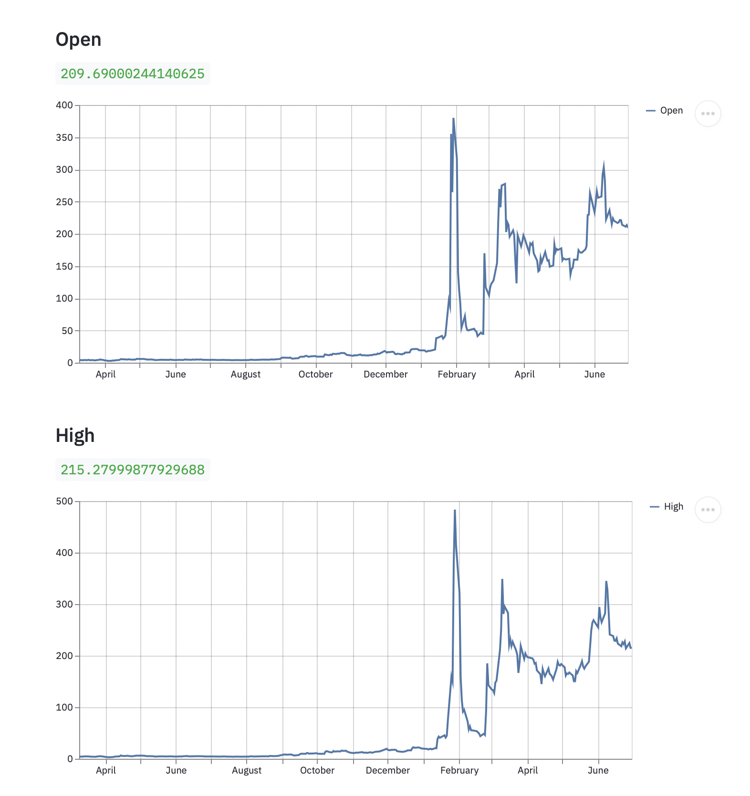
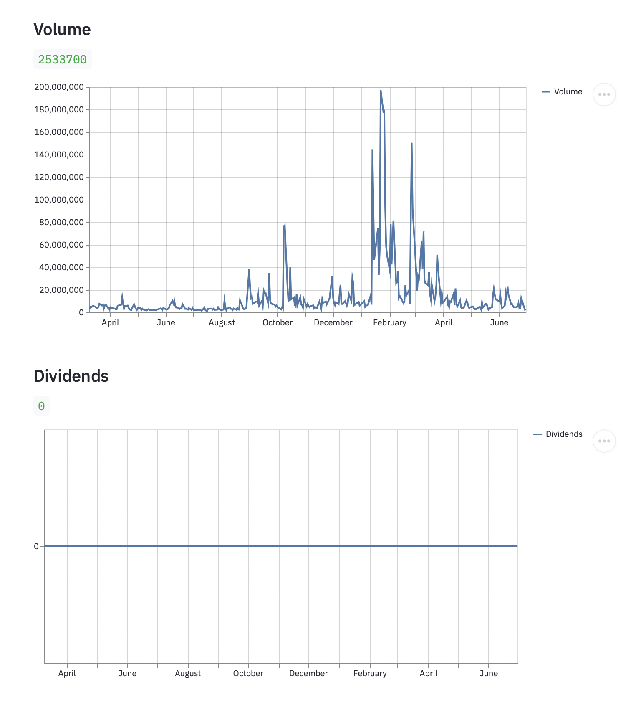
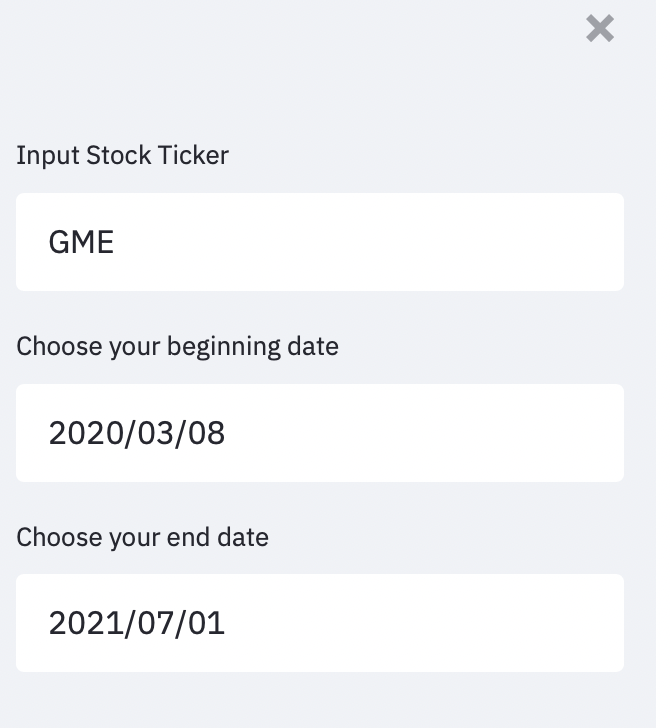
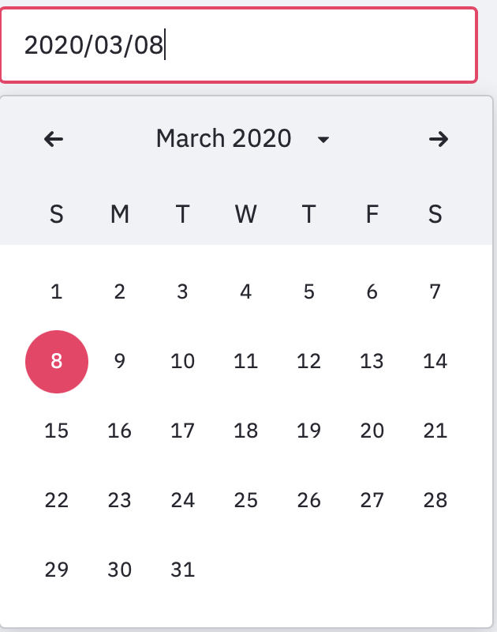

# DiamondHands

### Instructions:
1. Download 
2. Navigate to folder
3. Run it by typing
```
streamlit run diamond_hands.py

```
4. Open browser and type http://localhost:8501
5. Have fun! Make changes. 

<hr>
Stock App with Streamlit






